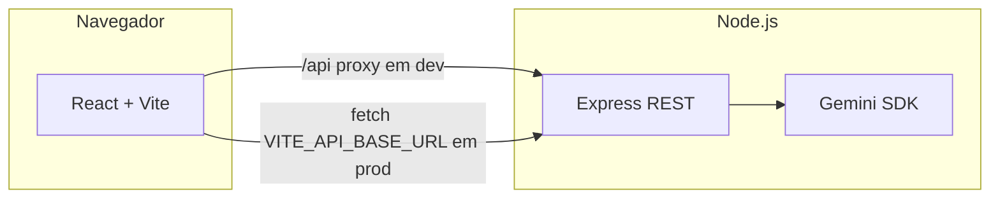

# devthomas/contratos

Monorepo **full stack** (marca pessoal **devthomas · freelance**) para emissão de documentos profissionais (contratos, NDA, orçamentos, notas/recibos, declarações, papel timbrado, carta de apresentação e currículo), com **preview em tempo real**, exportação para **PDF/impressão** e recursos de **IA** (Google Gemini) expostos por uma **API REST** no servidor — a chave de API **não** é enviada ao navegador.

Ideal para **entrevista técnica**: arquitetura clara (frontend / backend), contrato HTTP documentado (OpenAPI + Swagger), segurança básica (Helmet, CORS, validação) e scripts de desenvolvimento com um comando.

---

## Visão da arquitetura



| Pacote | Tecnologia | Função |
|--------|------------|--------|
| `frontend/` | React 19, Vite 6, TypeScript | Interface, estado local, preview e PDF (html2pdf via CDN) |
| `backend/` | Express 5, TypeScript, Zod | REST v1, integração Gemini, Swagger UI |
| `docs/API.md` | Markdown | Guia humano dos endpoints (complementa o OpenAPI) |

---

## Requisitos

- **Node.js 20+** (LTS recomendado)
- Conta Google com **API key** do modelo Gemini ([Google AI Studio](https://aistudio.google.com/apikey))

---

## Como rodar localmente

### 1. Instalar dependências (raiz do repositório)

```bash
npm install
```

O npm instala e liga os workspaces `frontend` e `backend`.

### 2. Configurar variáveis de ambiente

Copie o exemplo e ajuste a chave:

```bash
cp backend/.env.example backend/.env
```

Edite `backend/.env` e defina `GEMINI_API_KEY`. Opcionalmente: `PORT`, `FRONTEND_ORIGIN` (origens CORS, separadas por vírgula se precisar de mais de uma).

### 3. Subir API e interface com um comando

```bash
npm run dev
```

- **Frontend:** [http://localhost:3000](http://localhost:3000)  
- **API:** [http://localhost:4000/api/v1](http://localhost:4000/api/v1)  
- **Swagger (documentação interativa):** [http://localhost:4000/api/v1/docs](http://localhost:4000/api/v1/docs)

O Vite encaminha requisições que começam com `/api` para `http://localhost:4000`, então o frontend chama caminhos relativos como `/api/v1/ai/...` sem expor a chave.

### 4. Build de produção

```bash
npm run build
```

Gera `backend/dist` e `frontend/dist`. Para servir só a API compilada:

```bash
npm run start
```

(Sirva os arquivos estáticos de `frontend/dist` com nginx, Vercel, S3+CloudFront, etc., e aponte `VITE_API_BASE_URL` no build do frontend para a URL pública da API.)

---

## API REST (resumo)

| Método | Rota | Descrição |
|--------|------|------------|
| `GET` | `/api/v1/health` | Saúde do serviço e se a Gemini está configurada |
| `POST` | `/api/v1/ai/refine-services` | Refino de escopo em lista de itens |
| `POST` | `/api/v1/ai/generate-clause` | Geração de cláusula jurídica em pt-BR |
| `GET` | `/api/v1/docs` | Swagger UI |
| `GET` | `/api/v1/openapi.json` | Especificação OpenAPI 3 |

Detalhes, exemplos de corpo e códigos de erro: **[docs/API.md](docs/API.md)**.

---

## Destaques para conversa em entrevista

1. **Por que separar backend?** Segredo da IA e políticas de uso ficam no servidor; o bundle do React não contém `@google/genai` nem `GEMINI_API_KEY`.  
2. **Contrato da API:** OpenAPI mantido em `backend/src/openapi.ts`, servido em JSON e visualizado no Swagger.  
3. **Validação:** payloads com **Zod** e limite de tamanho do JSON no Express.  
4. **Headers:** **Helmet** no backend; CORS restrito a origens configuráveis.  
5. **Persistência atual:** rascunhos no `localStorage` do cliente (sem banco) — evolução natural seria Postgres + autenticação e multiusuário.

---

## Estrutura de pastas

```
free-contratos/
├── package.json              # workspaces + script dev/build
├── README.md
├── .env.example              # lembrete de variáveis (raiz)
├── docs/
│   └── API.md                # documentação narrativa da REST
├── backend/
│   ├── .env.example
│   ├── package.json
│   ├── tsconfig.json
│   └── src/
│       ├── index.ts          # bootstrap HTTP
│       ├── app.ts            # Express, CORS, rotas, Swagger
│       ├── openapi.ts        # especificação OpenAPI 3
│       ├── config.ts
│       ├── middleware/
│       ├── routes/ai.ts
│       └── services/geminiService.ts
└── frontend/
    ├── index.html
    ├── vite.config.ts
    ├── package.json
    └── src/
        ├── main.tsx
        ├── App.tsx
        ├── types.ts
        ├── services/api.ts   # cliente REST
        └── components/...
```

---

## Licença e aviso jurídico

Modelos de documento e textos gerados por IA **não substituem** assessoria jurídica. Use por sua conta e risco e revise sempre com um profissional habilitado quando aplicável.

---

## Autor

**devthomas/contratos** — portfólio técnico: emissor de contratos e correlatos (React, TypeScript, Express, OpenAPI).
